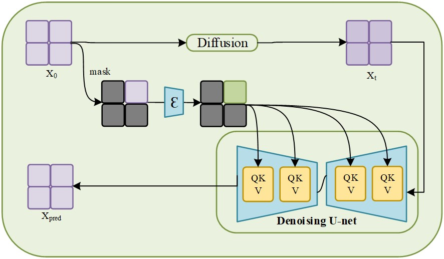
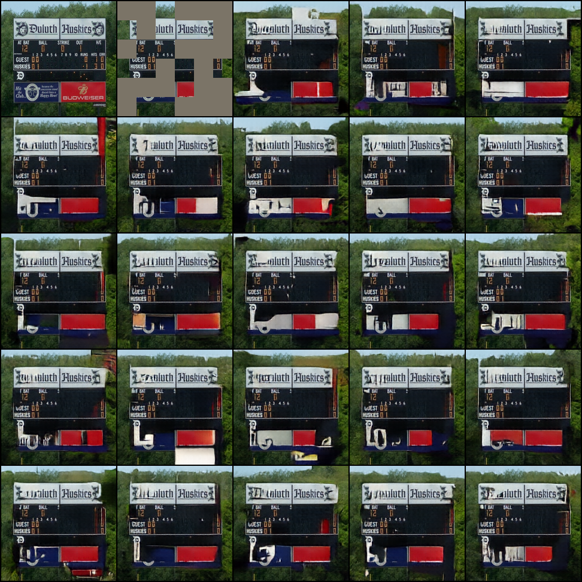
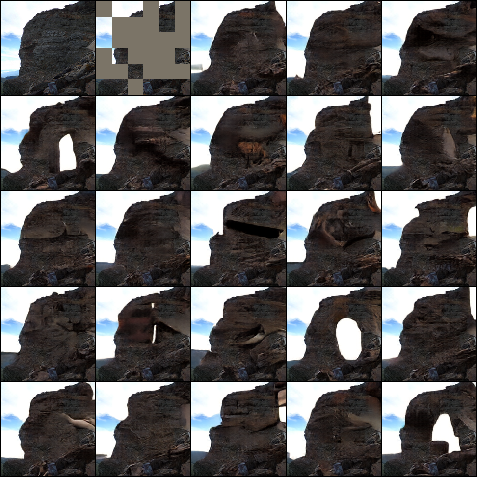
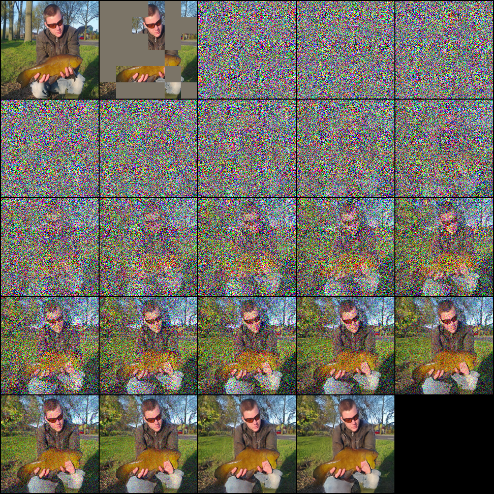
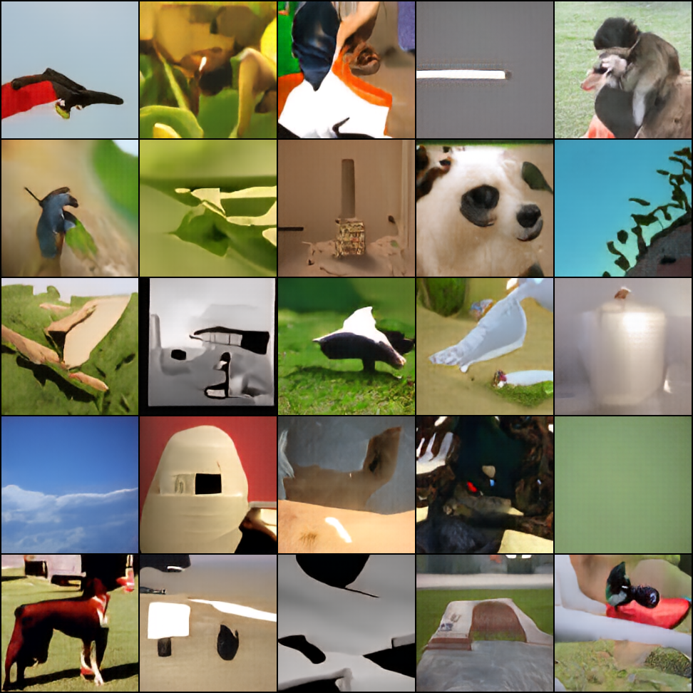

# Representation-Learning-Based-on-Diffusion-Model-and-Mask-Autoencoder

By [Zou kai](https://github.com/Jacky-hate)\*

# Model

    

# Inpainting

    

    

# Denoise

    

# Uncondition Generation

    

